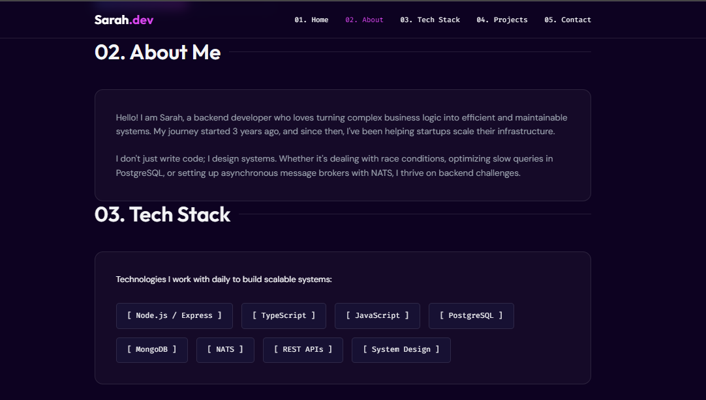
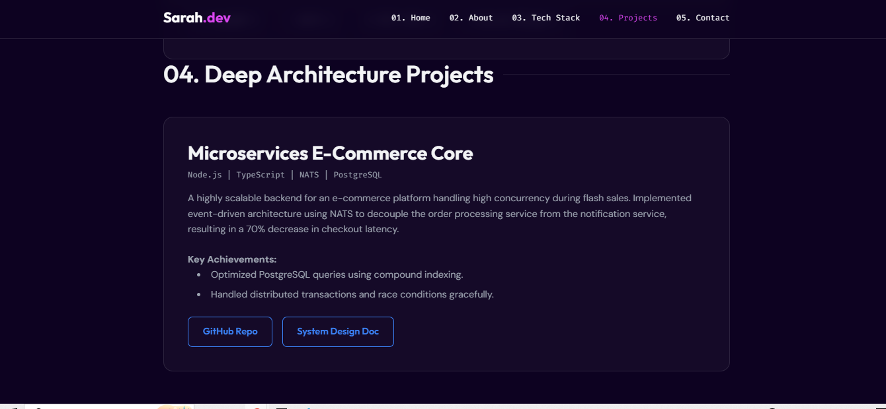
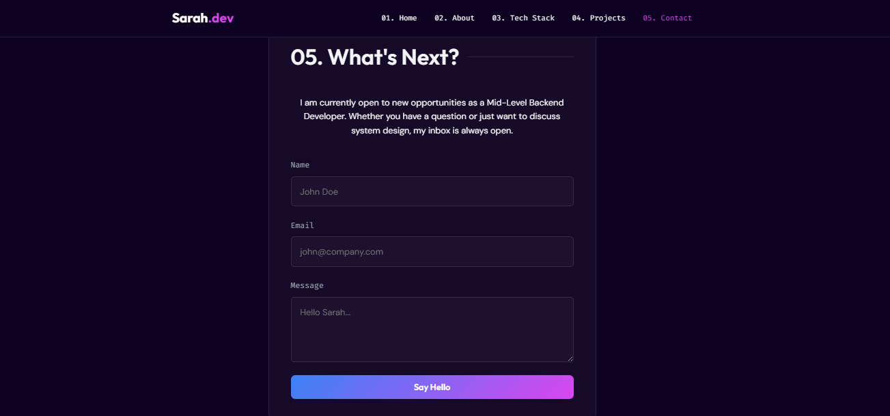
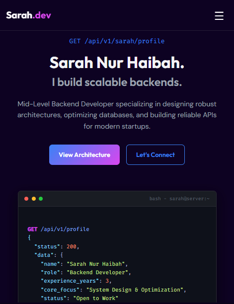
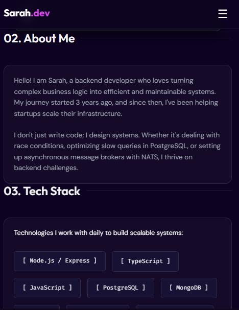
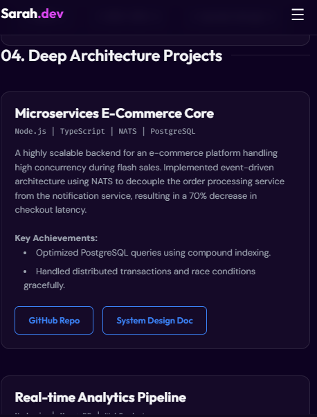
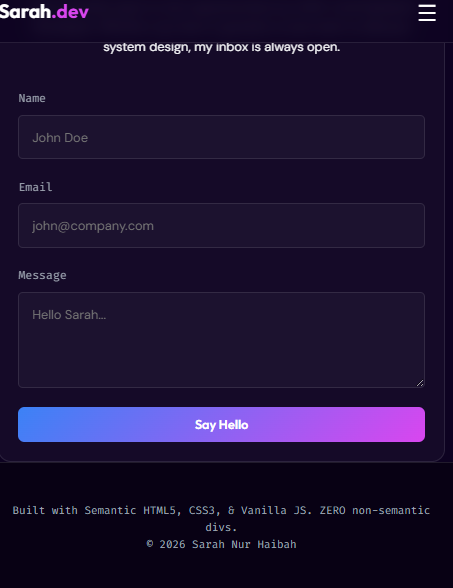

# 04: Final Results

## Template

```markdown
# Final Results — Portfolio Sarah Nur Haibah

## Portfolio Info

- **Nama:** Sarah Nur Haibah
- **Repository:** https://github.com/sarahnh05/Sarah-Nur-Haibah---Portfolio
- **Live URL:** https://sarahnh05.github.io/Sarah-Nur-Haibah---Portfolio/
- **Date:** 5 May 2026

---

## Screenshot: Desktop






---

## Screenshot: Mobile






---

## What I Learned

1. [Insight tentang process / RTCC-O]
   RTCC membantu membuat proses development jadi lebih terarah karena sejak awal sudah ada constraint yang jelas. Dengan adanya aturan smeantic HTML, mobile first, dan performance target, jadi lebih terstruktur dan memperhatikan kualitas code.

2. [Insight tentang semantic HTML / CSS]
   semantic html membuat struktur website lebih jelas, baik untuk developer maupun browser, serta membantu membangun hierarchy yang lebih rapi. Pendekatan terstruktur (mobile first, reusable class, consistent spacing), membuat styling scalable dan mudah di maintain

3. [Insight tentang collaboration dengan AI]
   kolaborasi dengan AI membantu mempercepat proses development terutama generete struktur awal dan eksplorasi solusi

---

## Challenges & Solutions

Challenge 1:

- mengikuti semua constraint RTCC
- membuat layout tetap rapi dan responsive
- output dari AI kadang tidak sesuai ekspektasi

How I Solved:

- memberikan context dan instruksi yang lebih jelas ke AI agar hasil lebih sesuai
```

---

## Checklist

```
[] Desktop screenshot ada?
[] Mobile screenshot ada?
[] No horizontal scroll?
[] All sections visible?
[] 3+ insights documented?
[] Challenges solved documented?
[] GitHub Pages URL available?
```
